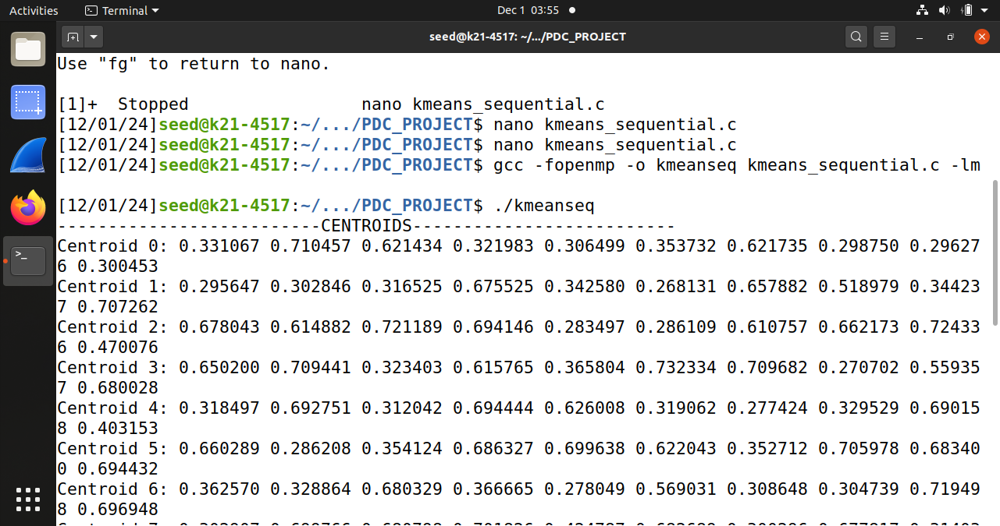

# Parallelizing K-means and BFS

This repository contains implementations of the K-means clustering algorithm and Breadth-First Search (BFS) algorithm, parallelized using OpenMP and MPI. The project aims to explore the impact of parallelization on performance metrics such as computation time, communication time, and scalability across varying data sizes.

## Team Members
- Aheed Tahir Ali - k214517@nu.edu.pk
- Maaz Imam - k213218@nu.edu.pk
- Muhammad Usman - k214890@nu.edu.pk

## Overview

Parallel computing plays a crucial role in modern data-intensive applications. This project utilizes OpenMP for shared-memory parallelism and MPI for distributed-memory parallelism to enhance the performance of two fundamental algorithms:
- **K-means Clustering**: Used for partitioning datasets into clusters.
- **Breadth-First Search (BFS)**: Employed to explore and analyze the structure of a graph.

## Implementation

The algorithms were implemented using:
- **OpenMP**: To leverage multi-threading capabilities of processors.
- **MPI**: To manage data distribution and synchronization across multiple computing nodes.

## Results

We conducted extensive testing to evaluate the performance improvements. Below are the visualizations of the algorithm executions under different settings:

### K-means Clustering Results

#### OpenMP Performance


### Kmeans Results

#### Sequential Performance



## Conclusions

The parallel implementations of K-means clustering and BFS demonstrate significant improvements in computation times and scalability. OpenMP showed substantial speedup in shared-memory environments, especially for larger datasets. MPI highlighted the benefits of distributed computing, though it also revealed the overhead associated with inter-process communication.

## How to Run

Instructions to build and run the implementations are as follows:
```bash
# Compile with MPI
mpicc -o bfs_mpi bfs_mpi.c -lm

# Run MPI program
mpirun -np 4 ./bfs_mpi

# Compile with OpenMP
gcc -fopenmp -o kmeans_omp kmeans_omp.c

# Run OpenMP program
./kmeans_omp
```
## Acknowledgments
Special thanks to Ashad Haseeb Ahad and the computational resources provided by our biological creators and spiritual creator, which were invaluable to our research.

For more detailed information about the methodologies, analyses, and results of our project, please refer to our [full project report](./pdcReport.pdf).
